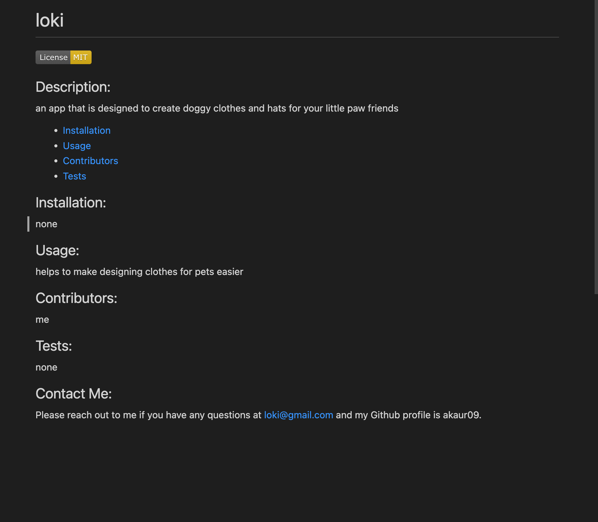

# readme-anew

##

## Description:

This is a quiz game made to test your knowledge in Javascript. It asks the player questions related to JS and gives four options that you can choose from. A timer of 60 seconds starts counting down when the quiz begins and answering incorrectly results in a penlaty of 10 seconds. Your score is the remaining time after all questions have been answered. The score can then be saved with your name and it will be displayed in the highscore gallery for you to compare with others.

 

### Table of contents:

* [Installation](#Installation)
* [Usage](#Usage)
* [Contributors](#Contributors)
* [License](#License)

 

## Installation:

Node is required in order for this generator to work. Once Node is installed clone this repository down. Then open your terminal and install inquirer into you rlocal machine by typing 'npm install inquirer'. You do not have to do an 'npm init' because a package,json is already present with in the repo. Once inquirer is downloaded, in terminal run 'node index.js'. This will prompt you to answer a few questions and then generate a README.md for you.
 

## Usage:

A generated README will look similar to this:

 

## Contributors:

**Amnider Kaur**

 

## License:

MIT License

Copyright (c) 2022 akaur09

Permission is hereby granted, free of charge, to any person obtaining a copy
of this software and associated documentation files (the "Software"), to deal
in the Software without restriction, including without limitation the rights
to use, copy, modify, merge, publish, distribute, sublicense, and/or sell
copies of the Software, and to permit persons to whom the Software is
furnished to do so, subject to the following conditions:

The above copyright notice and this permission notice shall be included in all
copies or substantial portions of the Software.

THE SOFTWARE IS PROVIDED "AS IS", WITHOUT WARRANTY OF ANY KIND, EXPRESS OR
IMPLIED, INCLUDING BUT NOT LIMITED TO THE WARRANTIES OF MERCHANTABILITY,
FITNESS FOR A PARTICULAR PURPOSE AND NONINFRINGEMENT. IN NO EVENT SHALL THE
AUTHORS OR COPYRIGHT HOLDERS BE LIABLE FOR ANY CLAIM, DAMAGES OR OTHER
LIABILITY, WHETHER IN AN ACTION OF CONTRACT, TORT OR OTHERWISE, ARISING FROM,
OUT OF OR IN CONNECTION WITH THE SOFTWARE OR THE USE OR OTHER DEALINGS IN THE
SOFTWARE.